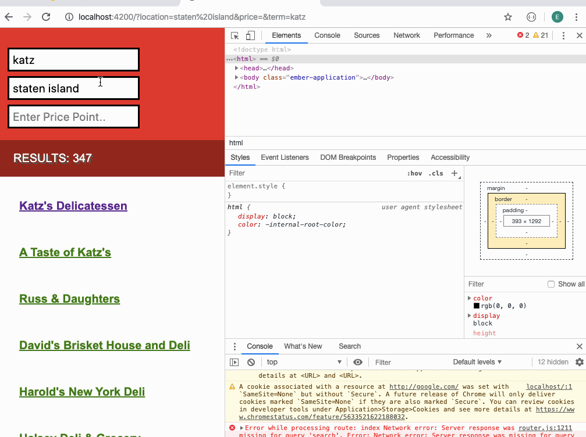

# Yelp Project

Author: Eugene chung

A simple web application which allows user to search for restaurants and save information about the restaurant into a database using firebase. 

## Time spent
 * Tutorials, research: around 24 hours
 * Coding required stories: 4 hours
 * Optional and extras: 0 hours

## User stories

### Required
 * [x] User can search for restaurants. 
 * [x] User can save desired restaurant information into firebase.
 * [x] Autocomplete is running at the most basic level
 

GIF created with [LiceCap](https://www.cockos.com/licecap/).

